# GCGEA Membership, Loan and Benefits Management System
## User Manual

**Gingoog City Government Employees Association (GCGEA)**
GCGEA Office, Gingoog City Hall, Gingoog City, Misamis Oriental
(088) 861-0000

*Version 1.0 — August 2026*

---

## Table of Contents

1. [Introduction](#1-introduction)
2. [Getting Started](#2-getting-started)
3. [Dashboard](#3-dashboard)
4. [Member Management](#4-member-management)
5. [Contributions](#5-contributions)
6. [Loan Management](#6-loan-management)
7. [Benefits](#7-benefits)
8. [Financial Management](#8-financial-management)
9. [Approval Inbox (My Approvals)](#9-approval-inbox-my-approvals)
10. [Reports](#10-reports)
11. [Administration](#11-administration)
12. [Notifications & My Profile](#12-notifications--my-profile)
13. [Glossary of Statuses](#13-glossary-of-statuses)
14. [Frequently Asked Questions](#14-frequently-asked-questions)

---

## 1. Introduction

The **GCGEA Membership, Loan and Benefits Management System (GCGEA MLBMS)** is the association's web-based system for managing member records, contributions, loans, benefit claims, and the association's finances. It replaces manual, paper-based record keeping with a single system that:

- Keeps one accurate record per member — personal details, contributions, loans, and benefits in one place.
- Routes applications (loans, benefits, member registrations, budgets, disbursements) through the correct approval steps automatically.
- Produces official receipts, statements, checks, and reports.
- Keeps a complete audit trail of who did what and when.

### Who this manual is for

This manual is written for **end users** — Membership Officers, Loan Officers, Treasury/Bookkeeping staff, Approving Officers, and Administrators who use the system day to day. Screens and menu items you see depend on the **permissions** assigned to your user account by an administrator; if a menu item described here does not appear for you, you likely don't have that permission — contact your system administrator.

### How the menu is organized

The left-hand sidebar is your main way of moving around the system. It is grouped into:

| Menu Group | What it's for |
|---|---|
| **Dashboard** | At-a-glance overview of the whole association |
| **Member Management** | Member records, registration, import |
| **Contributions** | Monthly dues and other member contributions |
| **Loan Management** | Loan applications, active/overdue loans, loan payments |
| **Benefits** | Benefit claims (retirement, mortuary, etc.) |
| **Approval Inbox** | Items waiting for your review/approval/release |
| **Financial Management** | Over-the-counter payments, annual budgets, disbursements |
| **Reports** | All printable/exportable reports |
| **Administration** | Offices, Users, Roles & Permissions, Approval Workflow setup, Audit Logs, System Settings |

---

## 2. Getting Started

### 2.1 Signing In

1. Open the system in your browser. You will see the **Sign In** page.
2. Enter your **Username or Email** and **Password**.
3. Optionally check **Remember Me** to stay signed in on that device.
4. Click **Sign In**.

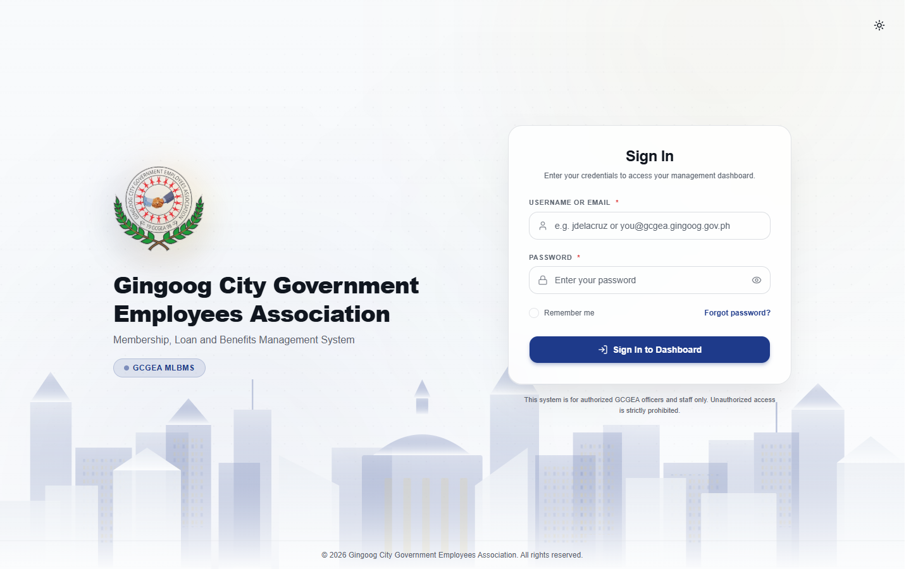

If your administrator has required a password change (for example, on a newly created account), you will be sent straight to the **Change Password** screen and must set a new password before you can use the rest of the system.

### 2.2 Forgot Your Password

1. On the Sign In page, click **Forgot Password**.
2. Enter your registered email address and submit.
3. You'll see a "Check Your Email" confirmation. Follow the link in the email to set a new password.

### 2.3 Changing Your Password Voluntarily

Go to **Change Password** (accessible from your account menu). Enter your **Current Password**, then your **New Password** (minimum 8 characters) and **Confirm Password**. You remain signed in on this device after changing it.

### 2.4 What You'll See After Signing In

You are taken to your **landing page** — for most staff this is the Dashboard; some roles with narrower permissions may land on a more specific screen. The sidebar on the left only shows the menu items your account has permission to use.

---

## 3. Dashboard

The Dashboard is the system's home screen — an "executive cockpit" summarizing the whole association's activity. What you see here depends on your permissions; each section below only appears if you have the matching module permission.

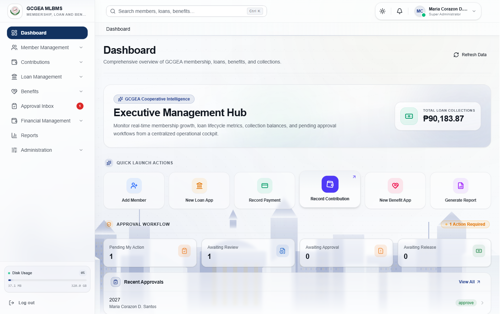

### 3.1 Quick Launch Actions

Shortcut buttons at the top of the Dashboard let you jump straight into common tasks (e.g., Add Member, Record Contribution, Create Loan) without navigating the menu.

### 3.2 Approval Workflow Summary

If you are an approver for any module, you'll see:
- **Pending My Action**, **Awaiting Review**, **Awaiting Approval**, **Awaiting Release** counters.
- A **Recent Approvals** list of items you've recently acted on, each linking to its detail page.

### 3.3 Key Metric Indicators

A tabbed panel with three views:
- **Overview & Members** — Total/Active/Retired Members, Pending Loan Applications, Pending Benefit Applications.
- **Financials & Balances** — Active Loans, Outstanding Loan Balance, Total Collections, Benefits Released, Monthly Contributions, and Fund Balances.
- **Reloans & Pipeline** — Pending, Awaiting Review, Approved, and Awaiting Release counts specifically for reloan (renewal) applications, plus members newly eligible to reloan this month.

### 3.4 Analytical Workspace

Charts under two tabs:
- **Financial Trends** — Monthly Loan Releases, Monthly Collections, Loan Status Distribution.
- **Membership & Scope** — Benefit Distribution by Type, Members per Office, Membership Growth by Year.

### 3.5 Activity & Monitoring Hub

Filterable activity feed (All / Loans & Payments / Alerts & Overdue / Members & Benefits) showing: Recent Loan Applications, Recent Payments, Upcoming Loan Due Dates, Overdue Accounts, Recent Benefit Applications, Recently Added Members, and Incomplete Member Profiles. Each card links to its full list ("View All").

---

## 4. Member Management

### 4.1 All Members

**Menu: Member Management → All Members**

The main member directory — every registered member, searchable and filterable.

- **Search** by name, member number, office, position, or phone number.
- **Filters**: Office, Sex, Membership Status (Active/Inactive/Suspended/Terminated/Deceased), Retiree Status.
- **Table** shows photo, name, position, sex, birthdate, auto-calculated age, office, contact info, date joined, tenure, membership status (with a toggle switch to set Active/Inactive), retiree status, and a **Profile Completeness** progress bar.
- **Row actions**: View, Edit, Archive (requires a typed reason).
- **Toolbar**: Print List, Export, Import, and **Add Member**.

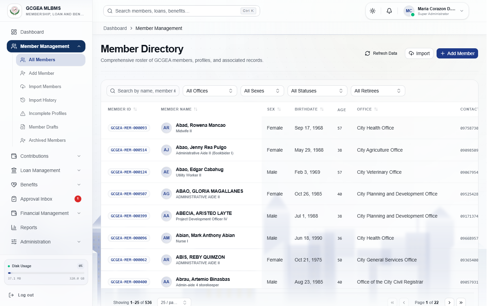

### 4.2 Adding / Registering a Member

**Menu: Member Management → Add Member**

The registration form is organized into five sections, all on one page:

1. **Personal Information** — Employee #, full name, sex, birthdate (age is calculated automatically), civil status, spouse name (if applicable), contact number, email, address, and a profile photo upload.
2. **Employment Information** — office, position, date of regular appointment (length of service is auto-calculated), employment status.
3. **Membership Information** — membership type, date became a GCGEA member (length of membership auto-calculated), membership status, retiree status, and optional monthly net pay.
4. **Beneficiaries** — add one or more beneficiaries (name, relationship, birthdate, contact, share %).
5. **Supporting Documents** — upload required documents: **Valid ID**, **Appointment Document**, **Membership Form**. If you entered a monthly net pay, a **Payslip / Net Take-Home Pay** document also becomes required.

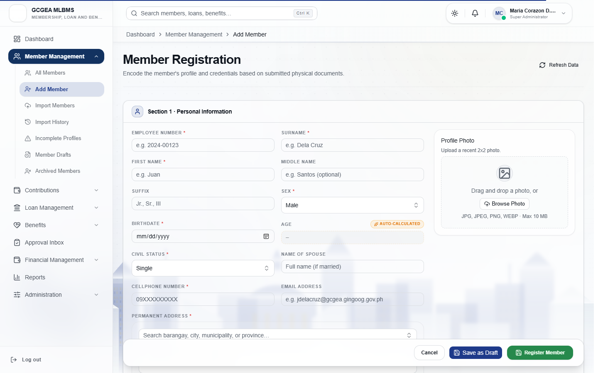

**Saving your work:**
- **Save as Draft** — keeps your progress and can be resumed later; the system also auto-saves every ~30 seconds while you're editing a draft. A completion-percentage bar shows how much is filled in.
- **Submit Registration / Register Member** — finalizes the record. Missing required fields or documents will be flagged before you can submit.

> **Note:** After registering a member, if the required membership fee has not yet been posted, the system reminds staff to post it under **Financial Management → Payments** before the member can be fully approved/activated.

### 4.3 Member Profile

**Menu: click any member's name from the directory**

Shows the member's complete record:

- Header with photo, name, member #, position, office, status badges, and completeness meter.
- Summary tiles: **Outstanding Loan Balance**, **Total Contributions**, **Total Benefits Received**.
- Quick-action buttons: **Record Contribution**, **Create Loan**, **Record Payment**, **Create Benefit Request** — each opens the relevant form pre-filled with this member.
- Tabs: Overview, Employment, Beneficiaries, Contributions (with a Void option), Contribution Allocation, deduction-type tabs (e.g., Cash Pabaon), Loans (with a Reloan button when eligible), Loan Payments, Benefits, Documents, and Activity History.

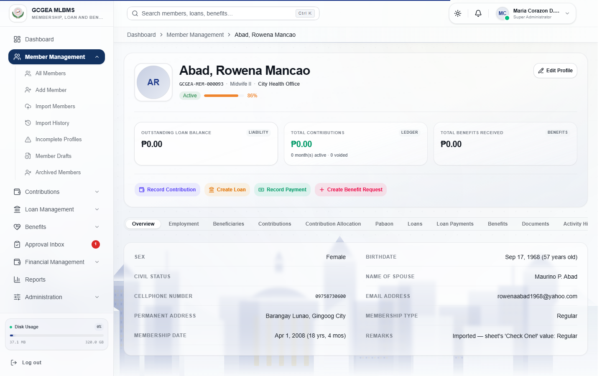

### 4.4 Importing Members in Bulk

**Menu: Member Management → Import Members**

An 11-step guided wizard for loading many members at once from an existing spreadsheet (Excel/CSV), instead of registering them one by one:

1. **Upload Workbook** (.xlsx, .xls, .csv)
2. **Select Worksheet**
3. **Detect Header Row** — the system finds your column headers automatically
4. **Map Columns** — match your spreadsheet's columns to system fields
5. **Preview Records & Validation** — every row is tagged New / Exact Duplicate / Probable Match / Possible Match / Invalid; invalid rows must be fixed before continuing
6. **Validate & Clean** — summary of fixes and warnings
7. **Resolve Offices** — match office names in your file to the offices already set up in the system
8. **Review Beneficiaries** — check the beneficiary names detected per member
9. **Review Legacy Loan Data** — any old loan balances found in the file are staged for review, not created as live loans yet
10. **Confirm Import** — final counts; you must check an acknowledgment box before importing
11. **Import Summary** — results, with a downloadable audit report (CSV)

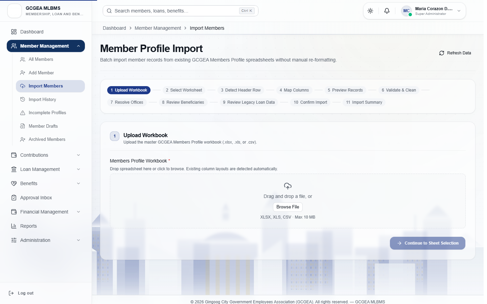

Use **Import History** to see past import batches, download their audit reports, or **Undo Import** — but only the single most recently completed batch can be undone, and doing so permanently deletes the members it created.

### 4.5 Incomplete Profiles, Drafts, and Archived Members

- **Incomplete Profiles** — members whose profile completeness is below 100%; a worklist for following up on missing information.
- **Member Drafts** — registrations started but not yet submitted; continue editing from here.
- **Archived Members** — members who have been archived (with a reason), kept for record-keeping.

---

## 5. Contributions

Contributions cover Monthly Dues and related deductions like Cash Pabaon.

### 5.1 Contribution Records

**Menu: Contributions → Contribution Records**

The ledger of all contribution transactions.

- KPI tiles: Total Contributions, Total Amount Collected, Paid Members, Unpaid Members, Contributions This Month.
- Filters: search, Period, Type, Office, Payment Method, Status, and a date range.
- Row actions: View Details, View History, Edit Record (Posted only), Void Transaction (requires a reason).

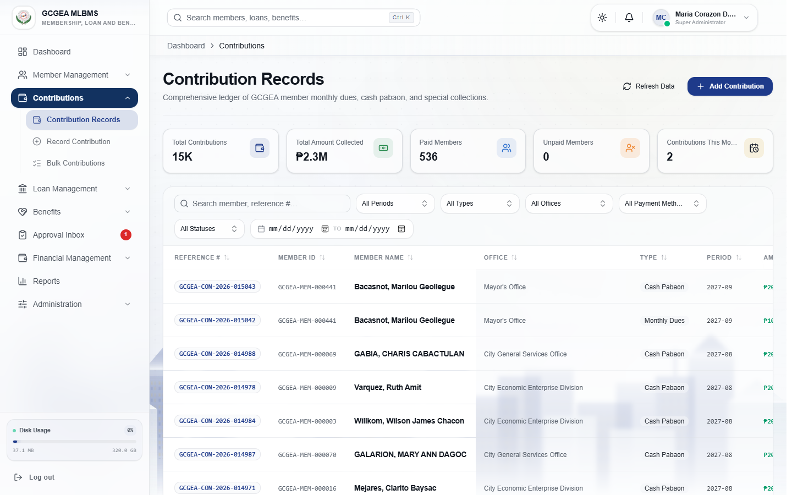

### 5.2 Recording a Contribution

**Menu: Contributions → Record Contribution**

1. **Select the member.** The system shows their contribution total, outstanding loan balance, and loan counts, plus their last recorded contribution.
2. **Enter payment details:** contribution period, the Monthly Dues amount (fixed by system settings), Cash Pabaon amount (auto-linked, if applicable), payment method, payment date, official receipt number, payroll reference, and remarks. You can add several period entries at once when creating new records.

The system blocks duplicate entries for the same member/period, and flags unresolved voided periods with a shortcut to fix them. On save, you'll get a generated reference number (e.g. `GCGEA-CON-2026-000001`).

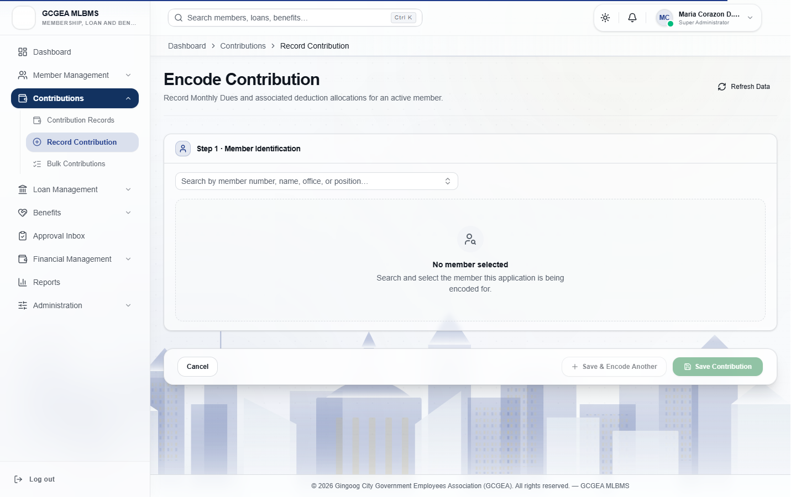

### 5.3 Bulk Contributions

**Menu: Contributions → Bulk Contributions**

For posting Monthly Dues across many members at once (e.g., a payroll run):

1. Set up the batch: contribution period, office(s), membership status filter, payment date/method, and payroll reference.
2. Click **Load Unpaid Members** — the system pulls all matching members and automatically excludes anyone already paid for that period.
3. Review/edit the roster grid — amounts, paid/unpaid status, and remarks per member. Use the toolbar to Apply Rate, Mark Paid/Unpaid, Reset Rates, or Exclude selected rows.
4. Click **Save & Post [N] Contribution Entries**, confirm in the dialog, and the batch is posted. A results banner shows dues saved, deductions created, duplicates skipped, and any failures.

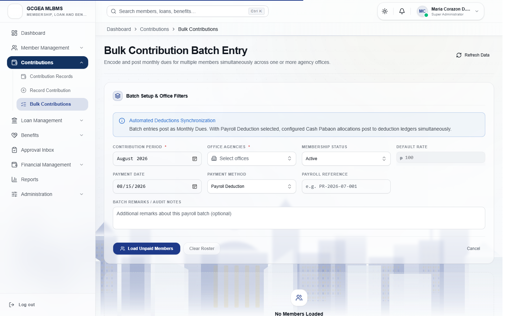

### 5.4 Contribution Detail & Void

Opening a record shows tabs for Overview (with Fund Allocations), Member Profile (their other contributions), Payment Data, Audit Timestamps, and Activity History. **Voiding** a record requires a reason and, for Monthly Dues, also voids the linked Cash Pabaon deduction for that period; you can then re-contribute for that month via a shortcut.

### 5.5 Contribution Reports

**Menu: Contributions → Contribution Reports** *(or via the Reports Center)*

Set your filters (date range, period, office, member, status, payment method) and click **Generate** to produce:
- KPI tiles: Total Records, Total Collected, Paid/Unpaid Members, Average Paid, Peak Single Receipt.
- Charts: Monthly Collections Trend, Collections per Office, Payment Method Breakdown.
- A detailed, exportable results table (Print, CSV, Excel, PDF).

---

## 6. Loan Management

### 6.1 Loan Applications

**Menu: Loan Management → Loan Applications**

The master list of all loan applications, in any status.

- KPI ribbon: Total Applications, Active Loan Accounts, Outstanding Portfolio, Overdue Accounts.
- Filters: search, Status, Type (New/Reloan), Reset Filters.
- Draft rows can be **Continued** (edited) or deleted; fully-paid/active/released loans show a **Reloan** button.

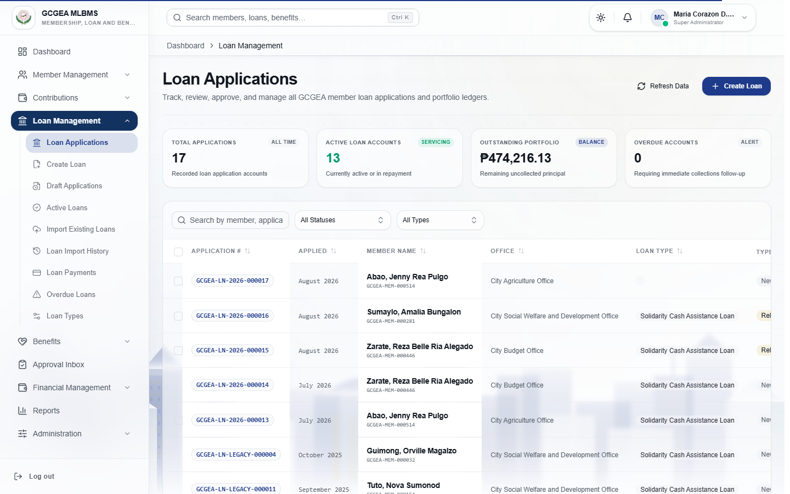

### 6.2 Creating a Loan Application

**Menu: Loan Management → Create Loan**

A 6-step wizard:

1. **Select Member** — the member must meet minimum membership length and have fully paid dues, or the system blocks you with an explanation.
2. **Loan Details** — application date, assigned loan officer, and (after saving the member's financial profile — net pay and Net Take-Home Pay document) the loan product, requested amount, repayment term, payment method, and purpose. A **Product Matrix** panel shows that loan type's amount range, interest rate, method, maximum term, processing fee, and required contribution months.
3. **Eligibility Check** — the system runs an automatic checklist and shows Eligible / Not Eligible / Eligible with Warning. If a user has override permission, a **Not Eligible** result can be overridden with a written justification and a board resolution reference — this is logged in the audit trail.
4. **Loan Computation** — principal, net proceeds, total interest, monthly amortization, processing fee, total payable, first due date, maturity date, and the full **amortization schedule**.
5. **Requirements** — upload the 5 required documents: Loan Application Form, Latest Net Take-Home Pay, Valid Government ID, Salary Deduction Authorization, and Promissory Note.
6. **Review & Submit** — a read-only summary; check the confirmation box and click **Submit Loan Application**.

You can **Save as Draft** at any step (auto-saves every 30 seconds).

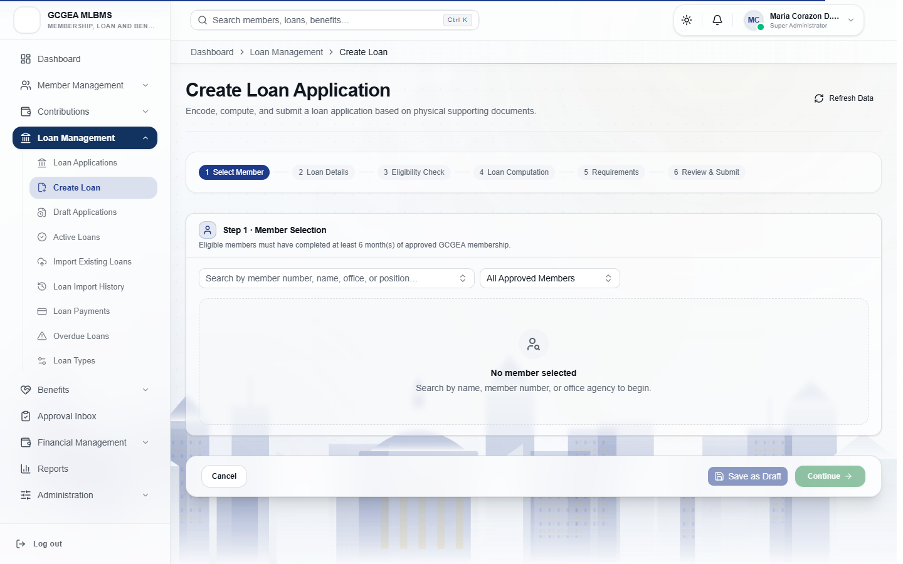

### 6.3 Loan Detail Page

Opening any loan shows its full account: application details, computation breakdown, full amortization schedule, payment history, requirements/eligibility, and approval history — plus buttons to **Record Payment**, **Reloan** (when eligible), **Print Application**, **Print Check** (once released by check), and view its **Loan Statement**.

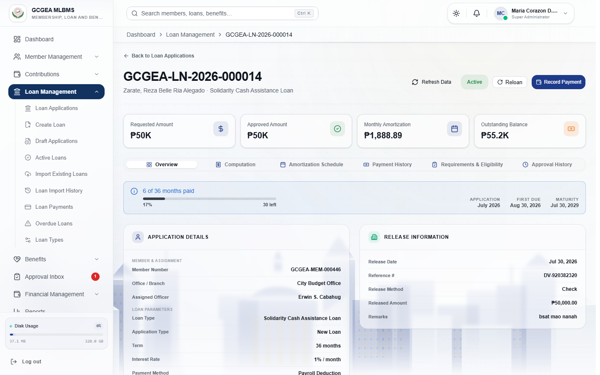

### 6.4 Active Loans / Overdue Loans / Loan Drafts

Pre-filtered views of the same loan list:
- **Draft Applications** — unfinished applications you can resume.
- **Active Loans** — loans currently being repaid (Released/Active/Overdue/Restructured).
- **Overdue Loans** — a collections follow-up worklist of accounts past due.

### 6.5 Loan Types

**Menu: Loan Management → Loan Types**

Admin-level screen to configure the loan products offered (name, interest rate, amount range, max term, processing fee, minimum membership/contribution months, etc.). **Add Loan Type** opens a form dialog; each existing type can be edited or deleted.

### 6.6 Importing Existing (Legacy) Loans

**Menu: Loan Management → Import Existing Loans**

Used to bring members' pre-existing loan balances from a legacy system into GCGEA MLBMS:

1. Choose the **Month of Balance** and upload your workbook (.xlsx/.xls/.csv).
2. Click **Generate Loan Preview** — the system matches each row to a system member automatically where possible; ambiguous matches show a searchable dropdown of candidates with a match score. Rows already imported for that balance month are automatically skipped.
3. Review the preview table (principal, interest, prior/recent payments, balances, status) and resolve any unmatched rows.
4. Click **Commit [N] Loan(s)** to create the loan and payment history records.

Use **Loan Import History** to review past batches, download audit reports, or **Undo Import** on the most recent batch (destructive — deletes the loans and payment history it created).

### 6.7 Reloan (Renewal) Wizard

Available from a member's eligible existing loan via the **Reloan** button. A 7-step wizard: Previous Loan Summary → Member & Eligibility → Current Financial Info → New Loan Details → Computation (which nets out the previous loan's remaining balance) → Requirements → Review & Submit. Works the same way as a new loan application, but is linked to the original loan and does not alter it.

### 6.8 Loan Statement

**From a loan's detail page → Loan Statement**

A printable "Statement of Loan" formatted like GCGEA's paper template: member/loan details, an installment-by-installment breakdown (with a date-range and payment-status filter for what's displayed), a balance summary, and signature lines for verification. Click **Print Statement** to print.

### 6.9 Loan Payments

**Menu: Loan Management → Loan Payments**

- **Loan Payments list** — search all posted loan payments by member, payment reference, or application number.
- **Record Payment** — pick the member, then the specific loan account (only loans with a balance show up). If an installment was only partially paid, the shortfall is flagged and can be included in the suggested amount. Enter payment date, amount paid, penalty (auto-computed if the loan is overdue), payment method, and OR number (auto-generated or manual). The system will not let you overpay past the outstanding balance.

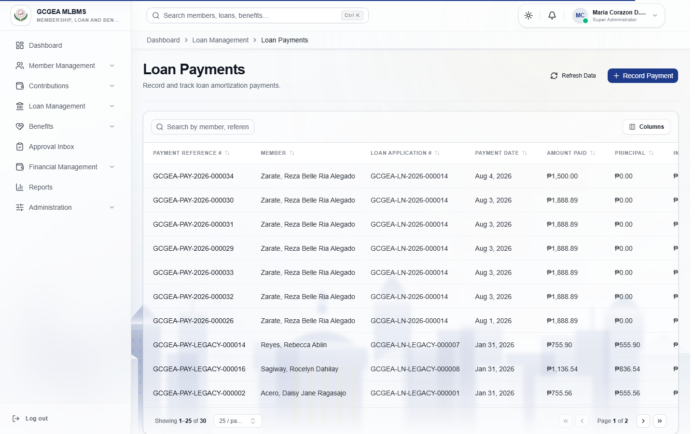

### 6.10 Printing a Loan Check

Once a loan is released by check, use **Print Check** from the loan detail page. The check layout is sized for standard 8.5×3.5 in check stock — print at 100% (actual size) and adjust your printer's margins for alignment with your pre-printed check forms.

---

## 7. Benefits

Benefits cover programs such as Retirement, Mortuary Cash Assistance, and similar member claims.

### 7.1 Benefit Applications

**Menu: Benefits → Benefit Applications**

Master list of every benefit application. Search by member/application number, filter by status. **Create Application** starts a new one; draft rows can be continued or deleted (including in bulk).

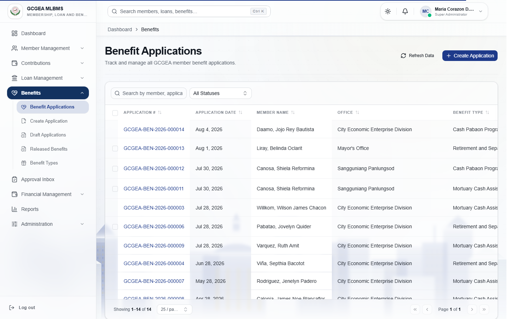

### 7.2 Creating a Benefit Application

**Menu: Benefits → Create Application**

A 4-step wizard:

1. **Select Member** — shows their contributions, loan balance, and recent benefit history.
2. **Benefit Details & Purpose** — application date, benefit type (only types the member currently qualifies for are shown — e.g. Retirement only appears if their Retiree Status is "Retired"), requested amount (auto-computed for formula-based benefits), incident date, recipient, assigned Benefits Officer, purpose, and required document uploads for that benefit type.
3. **Eligibility & Requirements** — an automatic eligibility checklist with an overall Eligible/Not Eligible result. If not eligible, an authorized user can apply an **override** with a written justification (logged in the audit trail).
4. **Review & Submit** — confirm all physical documents have been verified, then submit.

**Save Draft** works at any step. On submission you'll receive the generated application number.

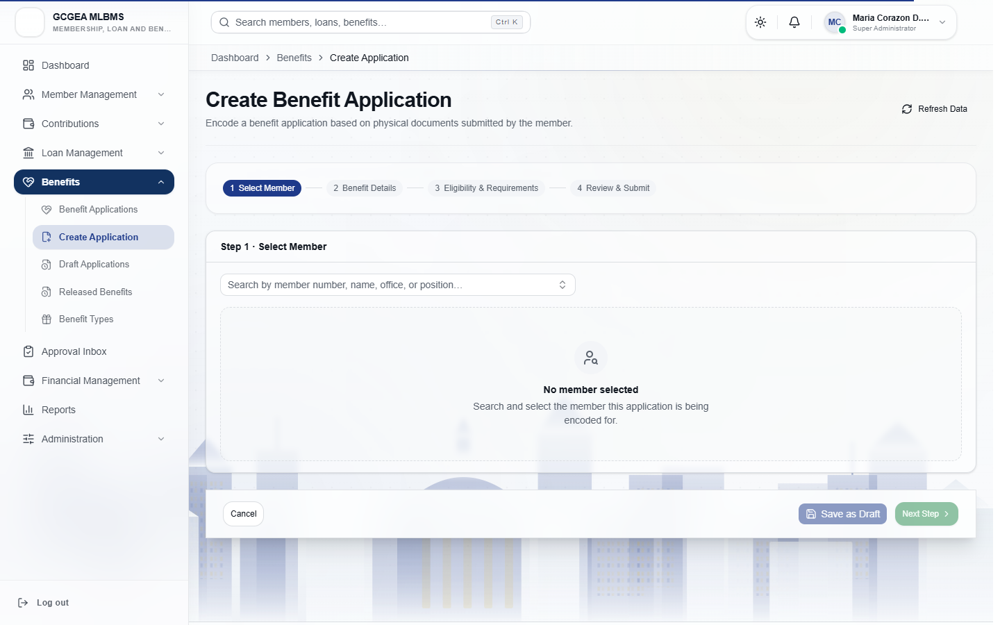

### 7.3 Benefit Detail & Release

Each application's detail page shows: requested/approved/released amounts, release date/reference, four tabs (Application Summary, Payment Status, Requirements, Approval History), and — once released — a **Print Check** button. If only partially released, the system will not let you release the remaining balance directly; contact an administrator.

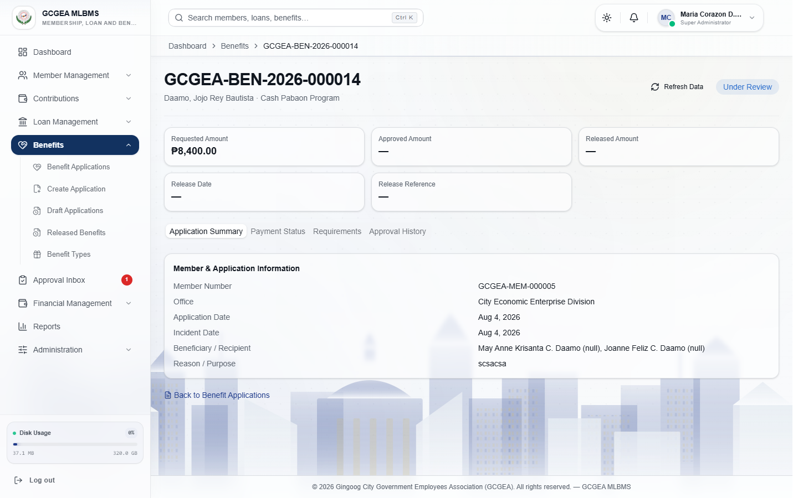

### 7.4 Draft Applications / Released Benefits

Pre-filtered views of the Benefit Applications list showing only **Drafts** (to continue/delete) or only **Released** benefits (a worklist for check printing/verification).

### 7.5 Benefit Types

**Menu: Benefits → Benefit Types**

Admin screen listing each benefit program with its default/maximum amount, frequency limit, minimum membership requirement, required documents, and whether approval is required. **Add Benefit Type** opens a configuration form. Note: certain "Core Benefit" types (Retirement/Separation and the two Mortuary benefits) share one policy — editing one syncs the proration schedule across all three.

### 7.6 Printing a Benefit Check

From a Released application's detail page → **Print Check**. Same 8.5×3.5 in check-stock layout and printing instructions as loan checks (see §6.10).

---

## 8. Financial Management

### 8.1 Payments (Over-the-Counter)

**Menu: Financial Management → Payments**

The Treasurer's hub for recording walk-in payments and issuing a receipt on the spot. Choose a payment type card (only types you have permission for appear):

- **Contribution Payment** — select member, then period, amount, method, date, and OR number. Warns on duplicate period entries.
- **Loan Payment** — select member, then their loan account; amount/penalty auto-suggested; blocks overpayment.
- **Benefit Payment** — select member, then their approved application; for Cash Pabaon-type benefits, shows a settlement ledger (approved amount minus prior contributions = net payable).
- **Membership Fee** — posts the one-time membership fee for a member who hasn't paid it yet.

Each posts immediately to the member's ledger and the association's cash balances — double-check the amount and OR number before saving.

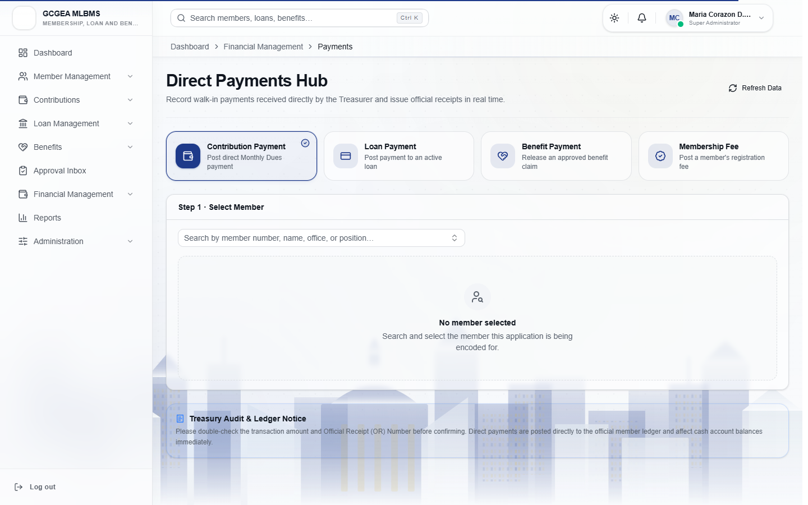

### 8.2 Annual Budgets

**Menu: Financial Management → Annual Budgets**

One record per fiscal year, moving through **Draft → For Approval → Approved** (or **Rejected**). List shows Fiscal Year, Estimated Revenue, Proposed Budget, Unallocated Balance, and Status. The **Treasurer** prepares and submits a budget; the **Approving Officer/President** approves it; an **Auditor** has read-only access. Click **Create Annual Budget**, or **Open**/**View** an existing one depending on your permissions and its status.

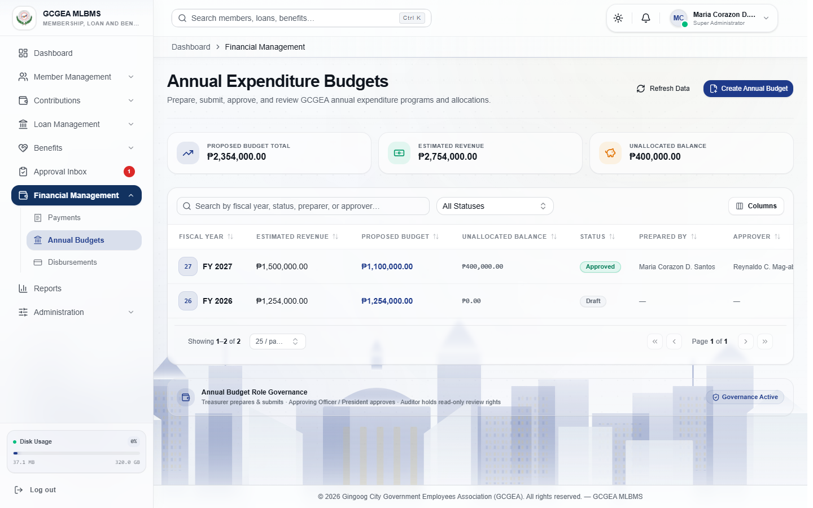

### 8.3 Disbursements

**Menu: Financial Management → Disbursements**

Expenses charged against an approved annual budget's line items.

1. **New Disbursement** — choose the approved budget and its particular/account line (the system shows that line's remaining balance), then enter date, payee, amount, payment method, and reference.
2. The record moves through its lifecycle with buttons that appear based on its current status and your permissions: **Save Draft → Submit for Approval → (approval happens in the Approval Inbox) → Mark as Paid → Print Check** (if paid by check) **→ Void Disbursement** (if needed, with a required reason).

A disbursement cannot be created until at least one annual budget has been approved.

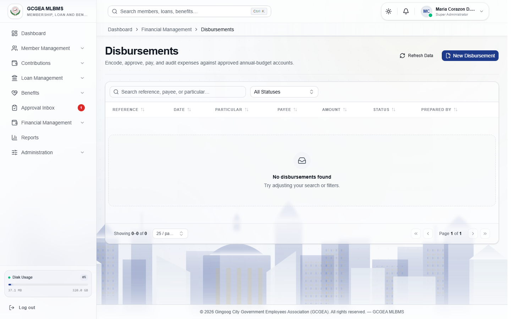

### 8.4 Printing Disbursement Checks

From a Paid disbursement → **Print Check**, same check-stock format and instructions as loan/benefit checks.

---

## 9. Approval Inbox (My Approvals)

**Menu: Approval Inbox** *(only visible if you are an approver for at least one module)*

Your personal worklist for anything routed to you for review, approval, release, rejection, or return — covering member registrations, loan applications, benefit applications, annual budgets, and disbursements.

- **Tabs**: Pending, For Approval, Approved, Rejected, Returned, Released.
- Search by reference/title/member/stage, and filter by date range.
- Click any item to open its **Approval Detail** page, where the full record (loan computation, benefit eligibility, budget line items, etc.) is shown alongside the applicant's profile and document uploads.
- **Actions available depend on the item's current stage and your permission**: Mark Reviewed, Approve, Release, Return for Revision (requires a reason), Reject (requires a reason).
- Once a loan is Approved or later, you can **Print / Save as PDF** an official approval sheet with signature lines.

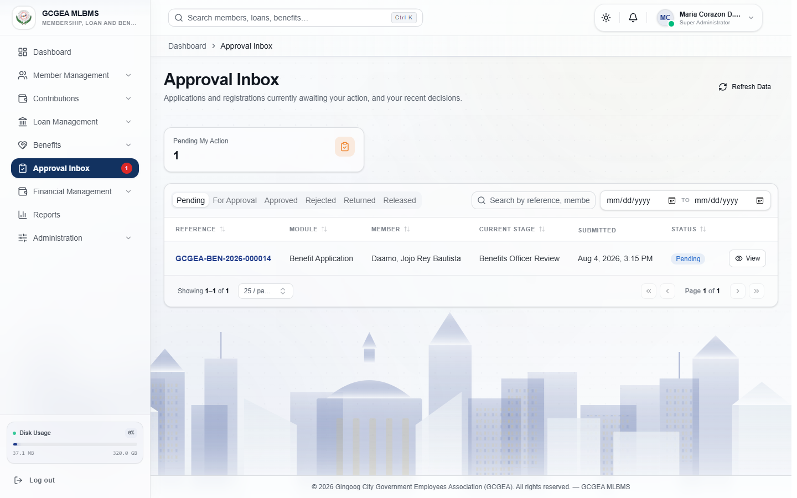

> How approval chains are configured (who reviews/approves/releases each module) is set up under **Administration → Approval Workflow** — see §11.4.

---

## 10. Reports

**Menu: Reports**

The Report Center groups all available reports by category (only categories you have permission for are shown):

| Category | Example Reports |
|---|---|
| Member Reports | Master List of Members, Active Members, Retired Members, Members by Office/Sex, New Members, Incomplete Profiles |
| Contribution Reports | Monthly Contributions, Contributions by Office, Unpaid Contributions, Member Contribution History, Payroll Deduction Summary, Fund Allocation Report |
| Loan Reports | Loan Applications, Approved/Rejected/Released/Active/Fully Paid Loans, Outstanding Balances, Overdue Loans, Loan Collections, Loan Aging Report, Member Loan Ledger |
| Benefit Reports | Benefit Applications, Approved/Released Benefits, Benefits by Type/Office, Member Benefit History |
| Financial Reports | Transaction Report, Financial Statement, Daily/Monthly Collection Report, Remittance Breakdown, Annual Budget, Monthly Disbursements, Cash Flow Summary, and more |

Click a report name to open its preview, then generate, print, or export it (CSV, Excel, PDF depending on the report).

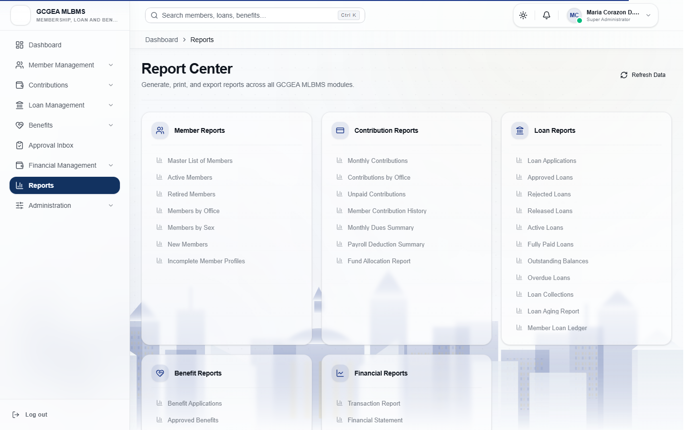

---

## 11. Administration

*Visible only to Administrators and roles with the matching permission.*

### 11.1 Offices

**Menu: Administration → Offices**

Manage the branch/office list members and staff belong to — Office Code, Name, Description, member count (click to jump to that office's members), and an Active/Inactive toggle. **Add Office** or the row **Edit** icon opens the same form dialog.

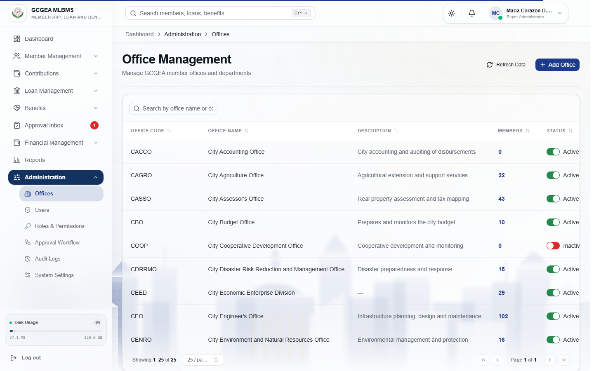

### 11.2 Users

**Menu: Administration → Users**

Manage staff accounts.

- **Users list** — name, username, email, primary/additional roles, effective permission count, account status, last login. Row actions: View, Edit, Manage Roles, Manage Permissions, Reset Password, View Login History, Activate/Deactivate.
- **Add/Edit User** — account details (name, username, email, password), Primary Role and Additional Roles, account status, "Require Password Change on First Login," and remarks. From here you can also grant **Additional Allowed Permissions** or **Explicitly Denied Permissions** on top of the assigned role(s) — a deny always overrides an allow.
- **User Permissions** — a detailed view of a user's effective access: which permissions come from their role vs. a direct override, with a **Sidebar Access Preview** showing exactly what menu they'll see. You can also **Copy Permissions from Another User** or **Reset to Role Defaults**.

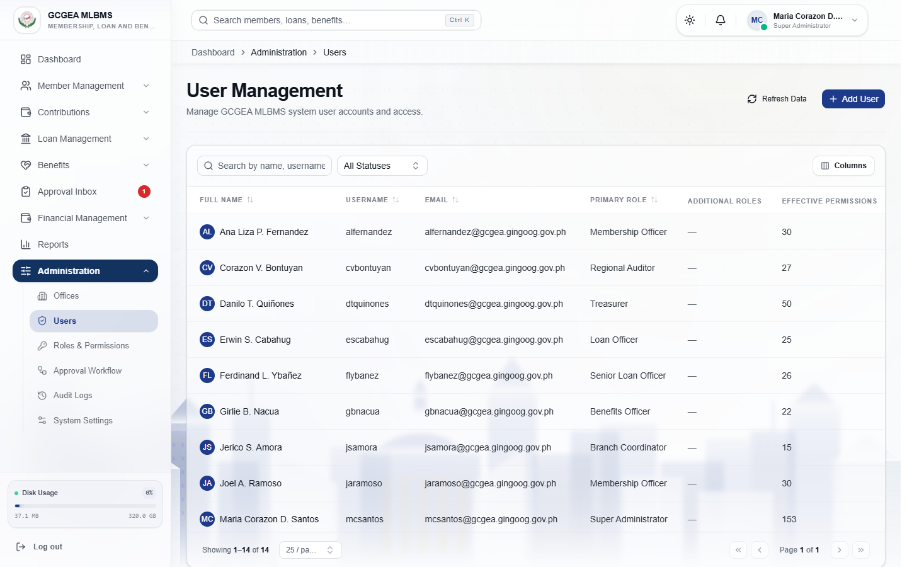

### 11.3 Roles & Permissions

**Menu: Administration → Roles & Permissions**

- **Roles list** — every role (built-in "System Roles" and custom ones), with assigned-user counts and permission counts. Actions: View, Edit, Manage Permissions, Duplicate, Activate/Deactivate, Delete (custom roles only).
- **Add/Edit Role** — name, code, description, status, and a full permission matrix; you can start from a preset or copy another role's permissions.
- **Manage Permissions** — dedicated screen with quick presets (View Only, Encoder, Approver, Full Access, Clear All) plus the granular matrix; shows how many currently-assigned users will be affected before you save.

> The **Super Administrator** role is protected — its permissions cannot be reduced.

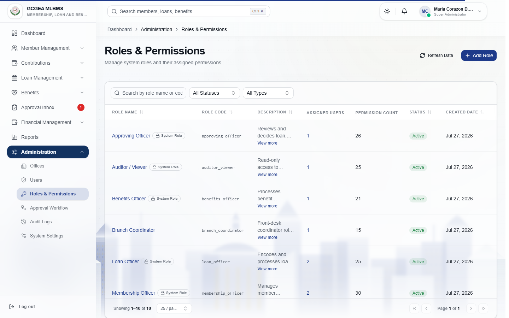

### 11.4 Approval Workflow

**Menu: Administration → Approval Workflow**

This is where you define **who** reviews, approves, and releases each module's submissions — Member Registration, Loan Application, Benefit Application, Annual Budget, and Disbursement each have their own card:

- Toggle a module's workflow **on/off** — if off, submissions in that module are auto-approved immediately with no review steps (a warning is shown).
- Add/remove **stages** after the fixed "Submission" starting stage; each stage is set to Review, Approve, or Release, and assigned to a specific **Role**, a specific **User**, or tied to an **Office**.
- Click **Save Workflow Setup** to apply.

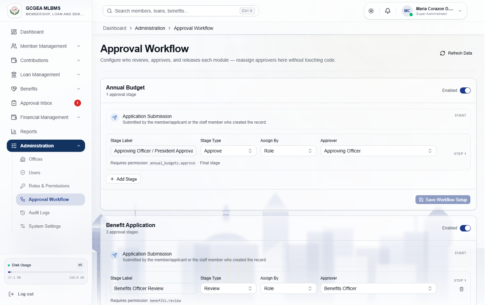

### 11.5 Audit Logs

**Menu: Administration → Audit Logs**

A read-only, searchable trail of system activity: date/time, user, role, module, action, record reference, IP address, device, and success/failure. Click the eye icon on any row to see a side-by-side comparison of the old and new values for that change.

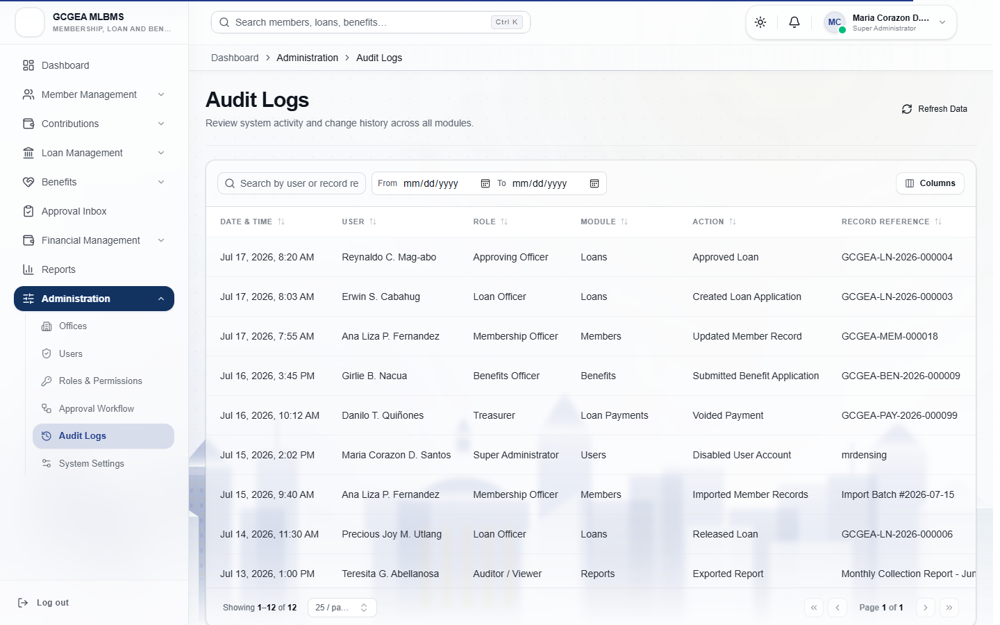

### 11.6 System Settings

**Menu: Administration → System Settings**

Organized into sections down a side menu: General Settings (system name), Association Profile, Membership Settings, Employment Statuses, Numbering Formats (how reference numbers like `GCGEA-CON-2026-000001` are generated), Loan Settings, Contribution Settings, Deduction Types, Benefit Settings, Notification Settings, Security Settings, Report Template (customize how printed reports look), Backup, and Appearance (logo, theme, sidebar branding). Each section has its own **Save** and **Reset to Default** controls. The **Backup** section lets you create, download, and restore full settings backups.

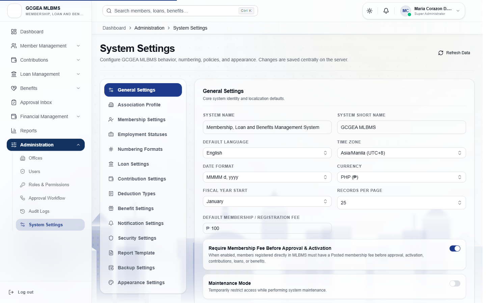

---

## 12. Notifications & My Profile

### 12.1 Notifications

Click the bell icon (or **Menu → Notifications**) to see system alerts relevant to your role. Toggle **Show unread only**, click a notification to open the related record (it's automatically marked read), or use **Mark all as read**.

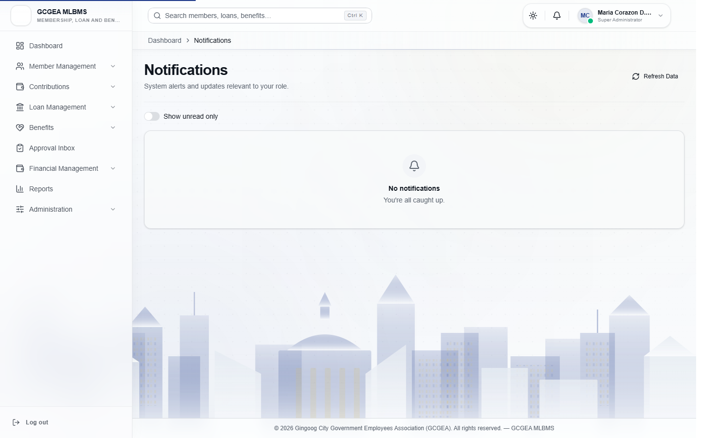

### 12.2 My Profile

**Account menu → My Profile**

View and update your own account: profile photo (upload/remove — JPG/PNG/WebP, up to 5 MB), your assigned role, and your **recent login activity** (device, time) for your own security awareness.

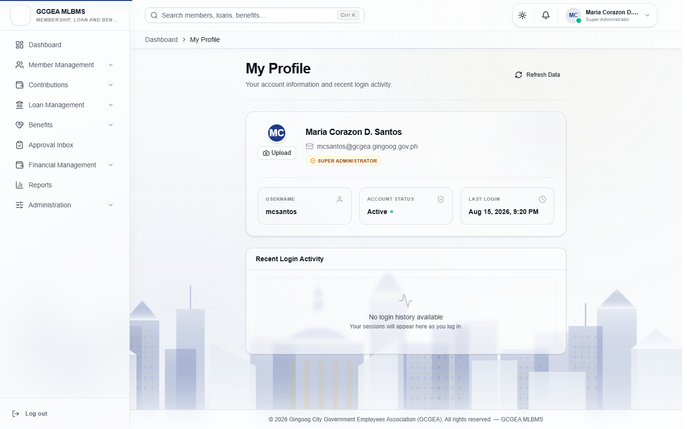

---

## 13. Glossary of Statuses

| Status | Meaning |
|---|---|
| **Draft** | Saved but not yet submitted; can still be edited or deleted |
| **Submitted / Under Review** | Sent in and awaiting the first approval stage |
| **For Approval** | Passed review, awaiting an approving officer's decision |
| **Approved** | Approved but not yet released/paid |
| **Released / Active** | Funds have been released to the member; loan is now being repaid |
| **Rejected** | Declined, with a reason recorded |
| **Returned** | Sent back to the encoder for revision, with a reason |
| **Fully Paid** | Loan balance fully settled |
| **Overdue** | Loan has one or more missed/late installments |
| **Restructured** | Loan terms were formally revised |
| **Posted** | Contribution/payment transaction is finalized |
| **Voided** | Transaction cancelled, with a reason recorded (does not delete the record) |

---

## 14. Frequently Asked Questions

**Q: A menu item I need isn't showing up. What do I do?**
A: Menu visibility is controlled by permissions. Contact your system administrator to review your role or user-level permissions under Administration → Users/Roles.

**Q: I made a mistake on a Posted contribution/loan payment — can I just delete it?**
A: No — posted financial records are not deleted. Use **Void** (with a reason) instead; this preserves the audit trail. You can then re-record the correct transaction.

**Q: A loan/benefit application says the member is "Not Eligible." Can I still proceed?**
A: Only if your account has override permission. You'll need to provide a written justification (and, for loans, a board resolution reference); this is recorded in the audit trail for accountability.

**Q: How do I undo a bulk import?**
A: Go to the module's Import History page. Only the **most recently completed** batch can be undone, via **Undo Import** — this permanently deletes the records that batch created, so use it carefully.

**Q: Where do I go to print a check for a released loan/benefit/disbursement?**
A: Open the record's detail page — a **Print Check** button appears once it's Released/Paid. Always print at 100% (actual size) on your pre-printed check stock and adjust printer margins as needed.

**Q: Who configures the approval chain (who approves what)?**
A: Administrators, under **Administration → Approval Workflow** (§11.4).

---

*End of manual. For issues not covered here, contact your GCGEA system administrator.*
